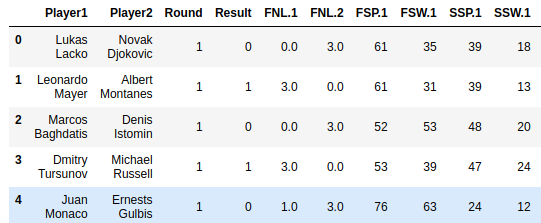
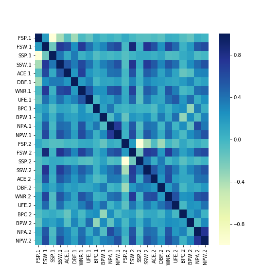
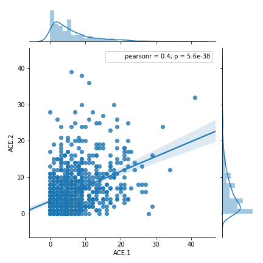
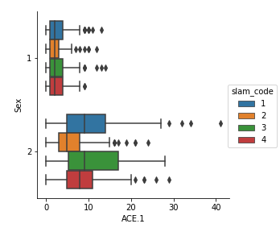
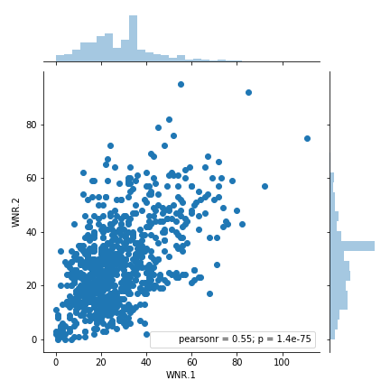
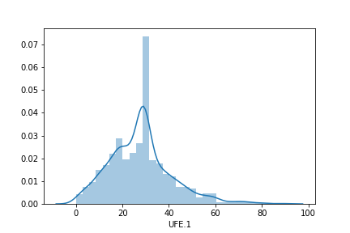
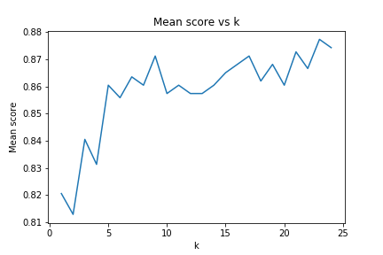
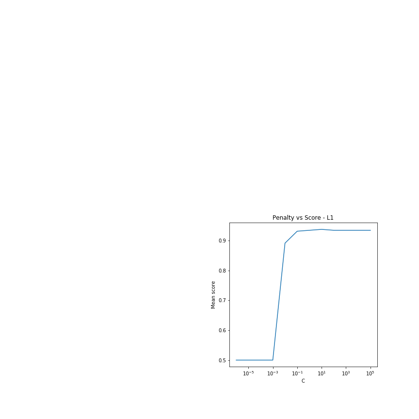
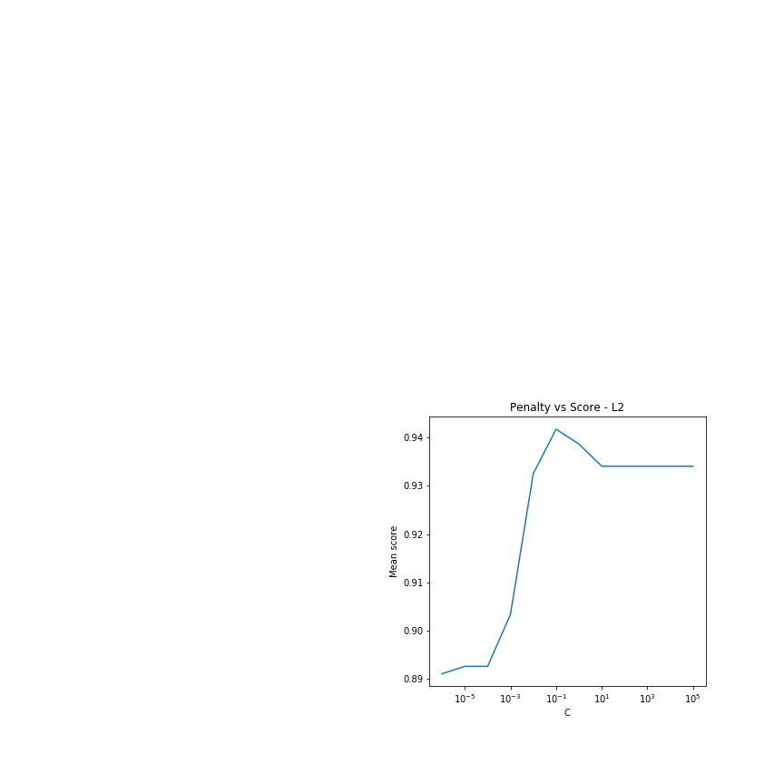

Tennis Prediction
================
Abishek Murali
January 28, 2018

``` r
library(kableExtra)
library(knitr)
library(magrittr)
```

The game of tennis is something that has always fascinated me. It is a combination of talent and mental persistence. Luck plays a very small role in deciding the outcome of a tennis game. This got me wondering about how hard it would be to predict results on tennis games based on game statistics and look at the most important factors that influence the outcome of a game. I will be treating this as a classification problem where I classify the result of a game as a win or loss for Player 1 based on the match statistics.

Initial analysis of the data
----------------------------

I have combined the data for men's and women's tennis. The outcome of women's tennis is decided by the player who wins 's 2 sets, whereas this is 3 sets for men's tennis. This resulted in a lot of empty values for `Set3`, `Set 4` and `Set 5`. For the purpose of this analysis, I've replaced the empty values with 0. This will not affect the results of my model in any manner. Below is a snippet of the imported data for analysis.



#### Imputing missing values

Below is a summary of the missing values in the dataset -

    # ACE.1         22
    # ACE.2         22
    # BPC.1          0
    # BPC.2          0
    # BPW.1          0
    # BPW.2          0
    # DBF.1          6
    # DBF.2          6
    # FNL.1        372
    # FNL.2        372
    # FNL1         560
    # FNL2         560
    # FSP.1          0
    # FSP.2          0
    # FSW.1          0
    # FSW.2          0
    # NPA.1         83
    # NPA.2         83
    # NPW.1         82
    # NPW.2         82
    # Result         0
    # Round          0
    # SSP.1          0
    # SSP.2          0
    # SSW.1          0
    # SSW.2          0
    # Sex            0
    # TPW.1        312
    # TPW.2        312
    # UFE.1        125
    # UFE.2        125
    # WNR.1        125
    # WNR.2        125
    # slam_code      0
    # ST1            0
    # ST2            0
    # ST3            0
    # ST4            0
    # ST5            0

I have removed the Total points won(TPW) as this highly correlated to the result of the game itself. I want to be looking at stats related to the players game for this analysis and not the statistics on the game itself. For the remaining missing values, I have imputed them with the median. This was done after looking at the distribution of the data and my knowledge of the game. One can expect the values of these statistics to vary about the mean and by introducing the median I am not introducing a huge `bias` in my model instead of making them `0`.

EDA
---

Exploring the correlation between the numeric variables at play here -



We notice that very few points have a high correlation which can prove to be beneficial while building the models and looking at the importance of features.

Aces could play a vital role in deciding the outcome of a game. Below is the distribution of Aces by Players 1 and 2 -



Aces are also influenced by the court. We would expect more Aces in Wimbledon as the ball is faster on a grass surface compared to the French open which has a slower playing surface. This makes the ball hold-up when it hits the surface, making it harder to serve an Ace. Below is a distribution of Aces by grand slams



Winners and unforced errors play a huge role in deciding the outcome of games. Below is a distribution of the winners and unforced errors -

 &gt; Winners



> Unforced error distribution

Model
-----

For the purpose of this classification problem, I will be building a kind, random forest and Logistic regression model. Below is a distribution of the distribution of numeric values.

``` r
kable(read.csv('./Numeric_desription.csv')) #%>%  kable("html") %>%
```

| X     |       FSP.1|      FSW.1|       SSP.1|       SSW.1|       ACE.1|       DBF.1|      WNR.1|      UFE.1|       BPC.1|       BPW.1|      NPA.1|      NPW.1|       FSP.2|      FSW.2|       SSP.2|       SSW.2|       ACE.2|       DBF.2|      WNR.2|      UFE.2|       BPC.2|       BPW.2|      NPA.2|      NPW.2|
|:------|-----------:|----------:|-----------:|-----------:|-----------:|-----------:|----------:|----------:|-----------:|-----------:|----------:|----------:|-----------:|----------:|-----------:|-----------:|-----------:|-----------:|----------:|----------:|-----------:|-----------:|----------:|----------:|
| count |  932.000000|  932.00000|  932.000000|  932.000000|  932.000000|  932.000000|  932.00000|  932.00000|  932.000000|  932.000000|  932.00000|  932.00000|  932.000000|  932.00000|  932.000000|  932.000000|  932.000000|  932.000000|  932.00000|  932.00000|  932.000000|  932.000000|  932.00000|  932.00000|
| mean  |   62.297210|   39.04185|   37.745708|   16.822961|    6.067597|    3.652360|   28.65987|   27.68026|    5.343348|    7.158798|   15.58691|   17.40290|   62.016094|   38.91309|   38.005365|   17.035408|    5.928112|    3.782189|   29.05258|   28.17436|    5.252146|    7.140558|   16.00966|   17.76609|
| std   |    7.900201|   17.40555|    7.896262|    8.595192|    5.929295|    2.646637|   15.29977|   13.43532|    3.993836|    5.123868|   11.44510|   11.25137|    8.124485|   17.47793|    8.136389|    8.719143|    5.992851|    2.728058|   14.90732|   14.40473|    3.827054|    5.030795|   11.93776|   12.43488|
| min   |   38.000000|    8.00000|   14.000000|    1.000000|    0.000000|    0.000000|    0.00000|    0.00000|    0.000000|    0.000000|    0.00000|    0.00000|   39.000000|    6.00000|    7.000000|    1.000000|    0.000000|    0.000000|    0.00000|    0.00000|    0.000000|    0.000000|    0.00000|    0.00000|
| 25%   |   57.000000|   26.00000|   33.000000|   10.000000|    2.000000|    2.000000|   17.00000|   18.75000|    2.750000|    3.000000|    8.00000|    9.00000|   57.000000|   26.00000|   33.000000|   11.000000|    2.000000|    2.000000|   18.00000|   18.00000|    2.000000|    3.000000|    8.00000|    9.00000|
| 50%   |   62.000000|   37.00000|   38.000000|   15.000000|    4.000000|    3.000000|   28.00000|   29.00000|    5.000000|    6.000000|   13.00000|   15.00000|   62.000000|   36.50000|   38.000000|   16.000000|    4.000000|    3.000000|   29.00000|   29.00000|    5.000000|    6.000000|   13.00000|   15.00000|
| 75%   |   67.250000|   49.25000|   43.000000|   22.000000|    8.000000|    5.000000|   35.00000|   33.00000|    7.000000|   10.000000|   20.00000|   23.00000|   67.000000|   49.00000|   43.250000|   22.000000|    9.000000|    5.000000|   36.00000|   35.00000|    7.000000|   10.250000|   20.00000|   23.00000|
| max   |   86.000000|  109.00000|   62.000000|   52.000000|   41.000000|   18.000000|  111.00000|   89.00000|   25.000000|   28.000000|   96.00000|   63.00000|   93.000000|  132.00000|   61.000000|   57.000000|   39.000000|   18.000000|   95.00000|   96.00000|   25.000000|   26.000000|   82.00000|   81.00000|

``` r
#   kable_styling()
```

We notice the difference in mean across the features. I have scaled the features to ensure a feature does not influence results just because it has different units of measurement.

The next step involved creating dummy variables to ensure factors are treated as categories and are transformed to columns with 1's and 0's. This is done to ensure the magnitude of the numeric values of a categorical column such as Grand slam code does not have any influence on the results.

I proceed to split the data into train-validation and test for this analysis. I will be using validation to tune the hyperparameters of the model and finally test to check how well it performs.

#### Results of model analysis

Below is a summary of the analysis of the model

<table style="width:100%;">
<colgroup>
<col width="28%" />
<col width="14%" />
<col width="15%" />
<col width="11%" />
<col width="30%" />
</colgroup>
<thead>
<tr class="header">
<th>Model</th>
<th>Training accuracy</th>
<th>Validation accuracy</th>
<th>Test accuracy</th>
<th>Hyper-parameters(if any)</th>
</tr>
</thead>
<tbody>
<tr class="odd">
<td>k-nearest neighbours classifier</td>
<td><span class="math inline">88.15%</span></td>
<td><span class="math inline">86.22%</span></td>
<td><span class="math inline">85.35%</span></td>
<td>neighbours = 23 after cross-validation</td>
</tr>
<tr class="even">
<td>Random forest classifier</td>
<td><span class="math inline">100%</span></td>
<td><span class="math inline">85.71%</span></td>
<td><span class="math inline">85.71%</span></td>
<td>not specified</td>
</tr>
<tr class="odd">
<td>Logistic regression with L1 penalty</td>
<td><span class="math inline">94.08%</span></td>
<td><span class="math inline">92.35%</span></td>
<td><span class="math inline">92.50%</span></td>
<td>Penalty parameter <span class="math inline"><em>C</em> = 1</span></td>
</tr>
</tbody>
</table>



 

> The graphs above justify the choice of hyperparameters I have used for this experiment.

> I was able to obtain the best accuracy from a Logistic regression model with `L1` penalty being applied. This model is robust to outliers that might occur in few of the games and in this case I did not want them to influence the prediction result. For example, I remember the John Isner and Mahut game in 2010 that went on forever. The number of Aces, Errors and Winners in that game was completely off the charts. This was a one-off scenario and I thought it wouldn't make sense to let such scenarios influence the prediction results.

#### Feature importance

Feature importance obtained from the logistic model -

    ('FSW.1', 2.6902803499806627),
     ('SSW.1', 1.5357912518131283),
     ('BPC.1', 1.4364215957988935),
     ('BPW.1', 1.0172119046483958),
     ('UFE.2', 0.6126331982169683),
     ('WNR.1', 0.4687371926625198),
     ('NPW.2', 0.2561535230887602),
     ('DBF.2', 0.21834632202200846),
     ('FSP.1', 0.04288805912591572),
     ('Round_2.0', 0.031221950427393636),
     ('ACE.1', 0.0),
     ('NPA.1', 0.0),
     ('NPW.1', 0.0),
     ('FSP.2', 0.0),
     ('SSP.2', 0.0),
     ('ACE.2', 0.0),
     ('Round_3.0', 0.0),
     ('Round_4.0', 0.0),
     ('Round_5.0', 0.0),
     ('Round_6.0', 0.0),
     ('Round_7.0', 0.0),
     ('Sex_1.0', 0.0),
     ('DBF.1', -0.20397455840859602),
     ('Round_1.0', -0.2681500307097742),
     ('UFE.1', -0.27147130742991604),
     ('SSP.1', -0.3332816552594803),
     ('NPA.2', -0.4719609779782114),
     ('WNR.2', -0.9045819136434631),
     ('SSW.2', -1.0057328250038224),
     ('BPC.2', -1.020080511756553),
     ('BPW.2', -1.4186786595523337),
     ('FSW.2', -3.124781826755869)

The First serve's won has the biggest influence on the results. The chances of a player losing are higher if his/her opponent wins more points on the first serve. We also notice that creating and converting Breakpoints in a game plays a vital role in deciding which way the results are going to swing.

References
----------

1.  <https://www.doc.ic.ac.uk/teaching/distinguished-projects/2015/m.sipko.pdf>
2.  <http://www.atpworldtour.com/>
